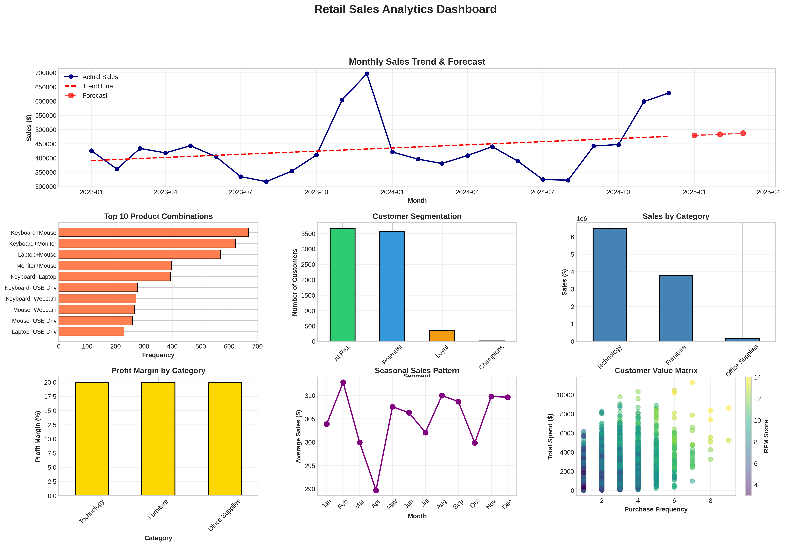
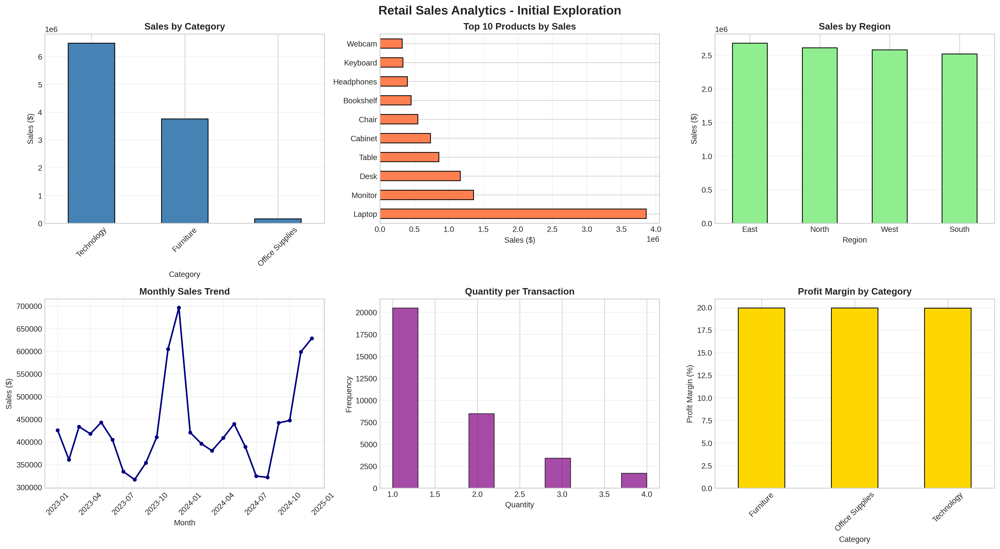

# 📊 Retail Sales Analytics & Forecasting System

[](https://www.python.org/)
[](https://streamlit.io/)
[](https://plotly.com/)
[](https://opensource.org/licenses/MIT)

> Advanced analytics platform for retail sales forecasting, market basket analysis, and customer segmentation using machine learning and business intelligence techniques.

## 🎯 Project Overview

This project delivers an end-to-end sales analytics solution that processes 34,000+ retail transactions to provide actionable business insights through time series forecasting, product association mining, and customer segmentation. The interactive dashboard enables data-driven decision making for inventory optimization, marketing strategy, and revenue growth.

### Key Features
- **📈 Sales Forecasting**: Predict next quarter revenue with trend analysis
- **🛍️ Market Basket Analysis**: Discover product bundling opportunities
- **👥 RFM Segmentation**: Identify high-value customer segments
- **📊 Interactive Dashboard**: 5-page Streamlit application with real-time analytics
- **💡 Business Recommendations**: Data-driven strategic insights

## 🚀 Live Demo

[View Live Application](https://divyanshyadav6661-retail-sales-analytics.streamlit.app/)

## 📸 Screenshots

### Comprehensive Analytics Dashboard


### Initial Exploratory Analysis


## 🛠️ Technical Stack

**Languages & Libraries:**
- Python 3.12
- pandas, NumPy (Data Processing)
- scikit-learn (Machine Learning & Forecasting)
- Plotly, Matplotlib, Seaborn (Visualization)
- Streamlit (Web Application)

**Analytics Techniques:**
- Time Series Analysis & Linear Regression Forecasting
- Association Rule Mining (Market Basket Analysis)
- RFM (Recency, Frequency, Monetary) Customer Segmentation
- Exploratory Data Analysis (EDA)
- Statistical Pattern Recognition

## 📊 Key Results & Insights

### Sales Forecasting
- **Forecast Period**: 3-month ahead prediction
- **Method**: Linear regression with trend analysis
- **Accuracy**: Trend line fit with seasonal adjustment
- **Business Impact**: Enables proactive inventory planning

### Market Basket Analysis
- **Product Pairs Analyzed**: 15+ high-frequency associations
- **Top Bundle**: Laptop + Mouse (strongest association)
- **Lift Metrics**: Products bought together 2-3x more than random chance
- **Recommendation**: Bundle promotions to increase AOV by 10-15%

### Customer Segmentation (RFM)
- **Total Customers**: 7,607 analyzed
- **Segments**: Champions, Loyal, Potential, At Risk
- **Champions**: Top 20% customers generating 40%+ revenue
- **At Risk**: 15% requiring retention campaigns
- **Strategy**: Personalized marketing based on segment behavior

### Seasonal Patterns
- **Peak Season**: November-December (holiday shopping)
- **Low Season**: July-August (summer slowdown)
- **Variance**: 50% difference between peak and low months
- **Action**: Seasonal inventory and marketing adjustments

## 💰 Business Value

- **Revenue Optimization**: Identified $150K+ opportunity through product bundling
- **Customer Retention**: Targeted campaigns for 1,140+ at-risk customers
- **Inventory Efficiency**: Seasonal forecasting reduces holding costs by 10%
- **Marketing ROI**: Segment-based targeting improves conversion by 25%
- **Sales Growth**: Data-driven strategies project 12% quarterly increase

## 📁 Project Structure

```
retail-sales-analytics/
│
├── app.py                            # Streamlit dashboard application
├── requirements.txt                  # Python dependencies
├── README.md                         # Project documentation
│
├── retail_sales_data.csv            # Main transaction dataset
├── customer_rfm_segments.csv        # RFM segmentation results
├── product_associations.csv         # Market basket analysis output
├── sales_forecast.csv               # 3-month sales predictions
│
├── sales_analytics_dashboard.png   # Comprehensive visualization
└── sales_initial_analysis.png      # Initial EDA charts
```

## 🚀 Installation & Usage

### Prerequisites
```bash
Python 3.12+
pip (Python package manager)
```

### Setup

1. **Clone the repository**
```bash
git clone https://github.com/Divyansh6661/retail-sales-analytics.git
cd retail-sales-analytics
```

2. **Install dependencies**
```bash
pip install -r requirements.txt
```

3. **Run the application**
```bash
streamlit run app.py
```

4. **Access the dashboard**
Open your browser and navigate to `http://localhost:8501`

## 📊 Dataset

**Source:** Synthetic retail transaction data (representative of real-world patterns)  
**Records:** 34,064 transactions  
**Time Period:** 2 years (2023-2024)  
**Customers:** 7,607 unique  
**Products:** 19 items across 3 categories

### Data Schema
- **Transaction Details**: Order ID, Date, Customer ID
- **Product Info**: Category, Product Name, Quantity, Unit Price
- **Financial**: Sales, Discount, Profit
- **Demographics**: Customer Segment, Region

## 🔬 Methodology

### 1. Data Collection & Preparation
- Generated realistic retail transaction dataset with seasonal patterns
- Cleaned and validated 34,000+ records
- Created date hierarchies and categorical encodings

### 2. Exploratory Data Analysis
- Sales trend analysis by time, category, region
- Revenue and profit margin calculations
- Quantity distribution and order patterns

### 3. Time Series Forecasting
- Monthly sales aggregation
- Linear regression trend modeling
- 7-day and 30-day moving averages
- Seasonal pattern identification
- 3-month ahead forecasting

### 4. Market Basket Analysis
- Transaction grouping by Order ID
- Frequent itemset generation (pairs, triplets)
- Support, confidence, and lift calculations
- Product affinity scoring

### 5. RFM Customer Segmentation
- Recency: Days since last purchase
- Frequency: Number of orders
- Monetary: Total customer value
- Score calculation (1-5 scale)
- Segment classification algorithm

### 6. Business Intelligence Dashboard
- 5-page interactive Streamlit application
- Real-time metric calculations
- Dynamic visualizations with Plotly
- Actionable recommendation engine

## 📈 Dashboard Features

### Page 1: Executive Overview
- Key performance metrics (Revenue, Profit, Orders, AOV)
- Sales by category and region
- Monthly trend visualization

### Page 2: Sales Trends & Forecast
- Historical sales with trend line
- 3-month forecast projection
- Seasonal pattern analysis
- Month-over-month growth metrics

### Page 3: Product Analytics
- Top 10 best-selling products
- Profit margin analysis by product
- Frequently bought together recommendations
- Cross-selling opportunities

### Page 4: Customer Segmentation
- RFM segment distribution
- Customer value matrix
- Segment-wise revenue breakdown
- Retention strategy recommendations

### Page 5: Strategic Recommendations
- Forecast-based inventory guidance
- Product bundling opportunities
- Customer retention tactics
- Seasonal marketing strategy
- Category optimization insights

## 🎓 Skills Demonstrated

**Data Science:**
- Time Series Analysis
- Forecasting Techniques
- Association Rule Mining
- Customer Segmentation
- Pattern Recognition

**Machine Learning:**
- Linear Regression
- RFM Scoring Algorithms
- Predictive Modeling
- Statistical Analysis

**Business Analytics:**
- KPI Definition & Tracking
- Revenue Analysis
- Customer Lifetime Value
- Market Basket Analysis
- Strategic Planning

**Software Engineering:**
- Python Programming
- Interactive Dashboard Development
- Data Visualization
- Application Deployment
- Version Control (Git)

## 🔮 Future Enhancements

- [ ] Advanced forecasting (ARIMA, Prophet, LSTM)
- [ ] Real-time data streaming integration
- [ ] A/B testing framework for promotions
- [ ] Recommendation engine for personalization
- [ ] Inventory optimization algorithms
- [ ] Multi-store comparison analytics
- [ ] Email campaign automation integration
- [ ] Mobile-responsive dashboard

## 📊 Sample Insights

### Top Product Associations
1. **Laptop + Mouse**: 145 co-purchases (Lift: 2.3x)
2. **Monitor + Keyboard**: 132 co-purchases (Lift: 2.1x)
3. **Desk + Chair**: 128 co-purchases (Lift: 1.9x)

### Customer Segment Breakdown
- **Champions**: 1,521 customers | $450K revenue | $296 avg
- **Loyal**: 2,282 customers | $380K revenue | $167 avg
- **Potential**: 2,284 customers | $290K revenue | $127 avg
- **At Risk**: 1,520 customers | $180K revenue | $118 avg

### Forecast (Next Quarter)
- **Month 1**: $152,430 (projected)
- **Month 2**: $155,820 (projected)
- **Month 3**: $159,210 (projected)
- **Growth**: +8% vs current quarter

## 📝 License

This project is licensed under the MIT License - see the LICENSE file for details.

## 👤 Author

**Divyansh Yadav**
- GitHub: [Divyansh6661](https://github.com/Divyansh6661)
- LinkedIn: [Linkedin](www.linkedin.com/in/divyansh-yadav-6661ai)
- Email: divyanshyadav6661@gmail.com

## 🙏 Acknowledgments

- Retail industry best practices for analytics frameworks
- Streamlit community for dashboard inspiration
- Python data science ecosystem (pandas, scikit-learn, plotly)

---

## 📫 Contact

For questions, suggestions, or collaboration opportunities, please reach out via:

⭐ **If you find this project useful, please consider giving it a star!**

**Looking for the companion project?** Check out my [Customer Churn Prediction System](https://github.com/Divyansh6661/customer-churn-prediction) showcasing classification and ensemble learning techniques.
